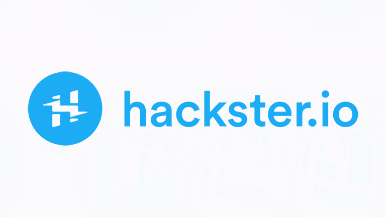

<div align="center">


<br />

# OpenToys

### Open-Source Local Voice AI for Toys, Companions, and Robots that run on your MacBook

*OpenToys is the local-first platform version of [ElatoAI](https://www.github.com/akdeb/ElatoAI). No cloud required, no subscription lock-in, and your data stays private on-device.*

**Apple Silicon · Rust + React · ESP32-S3 · Whisper ASR · Qwen3-TTS · MLX LLMs**

[](#stack)
[](#esp32-diy-hardware)
[](LICENSE)
[](https://github.com/akdeb/open-toys/releases/latest/download/OpenToys_0.1.0_aarch64.dmg)

</div>

## Featured in
<p>
  <a href="https://www.wired.com/story/the-new-wild-west-of-ai-kids-toys/" target="_blank">
    
  </a>
  <strong>The New Wild West of AI Kids Toys</strong>
  <br/>
  <a href="https://www.wired.com/story/the-new-wild-west-of-ai-kids-toys/">Read the WIRED article →</a>
</p>
<br clear="left"/>

<p>
  <a href="https://www.hackster.io/news/the-easy-way-to-build-interactive-ai-toys-for-your-kids-0ba401a9328f" target="_blank">
    
  </a>
  <strong>The Easy Way to Build Interactive AI Toys for Your Kids</strong>
  <br/>
  <a href="https://www.hackster.io/news/the-easy-way-to-build-interactive-ai-toys-for-your-kids-0ba401a9328f">Read the Hackster article →</a>
</p>
<br clear="left"/>

## 🎥 Demo Video

[](https://youtu.be/V5uNgMRsBHE)

## News
- **2026-03-14:** OpenToys launched🎉 And it's Pi Day! If you're looking to run realtime AI models like OpenAI Realtime, Gemini, Eleven Labs and more on your ESP32 device, check it out [here](https://www.github.com/akdeb/ElatoAI). 

## Why OpenToys?

- **Fully Local**: NO cloud, NO subscriptions, NO data leaving your home, FREE AI forever.
- **Multilingual**: OpenToys supports multiple languages and accents: English 🇺🇸/🇬🇧, Chinese 🇨🇳, Spanish 🇪🇸, French 🇫🇷, Japanese 🇯🇵, Korean 🇰🇷, Portuguese 🇵🇹, German 🇩🇪, Italian 🇮🇹 and more!
- **Voice Cloning**: Clone your own voice or your favorite characters with <10s of audio.
- **Customizable**: Build your own toys, companions, robots and more with an ESP32.
- **Open-source**: The community is open-source and free to use and contribute to.

## App Design
<!--  -->


## ESP32 DIY Hardware


[Firmware Docs ⏭️](https://www.elatoai.com/docs/blog/firmware)

## Download & Install

- Direct DMG: [OpenToys_0.1.0_aarch64.dmg](https://github.com/akdeb/open-toys/releases/latest/download/OpenToys_0.1.0_aarch64.dmg)
- All releases: [GitHub Releases](https://github.com/akdeb/open-toys/releases)

## 🚀 Quick Start (for development)

1. Clone the repository with `git clone https://github.com/akdeb/open-toys.git`
2. Install Rust and Tauri with `curl https://sh.rustup.rs -sSf | sh`
3. Install Node from [here](https://nodejs.org/en/download)
4. Run `cd app`
5. Run `npm install`
6. Run `npm run tauri dev`

## Cards & Stories
Create experiences with personalities that can play games, tell stories, engage in educational conversations. Here are some of the default characters with more prompt details in [personalities.json](./app/src/assets/personalities.json).

<p align="center">
  
  
  
  
</p>

## Stack

- STT: Whisper Turbo ASR
- TTS: Qwen3-TTS and Chatterbox-turbo
- LLMs: any LLM from [`mlx-community`](http://huggingface.co/mlx-community) (Qwen3, Llama, Mistral3, etc.)
- App: Tauri, React, Tailwind CSS, TypeScript, Rust
- Platform focus: Apple Silicon (M1/2/3/4/5)
- Hardware device: ESP32-S3

## ⚡️ Flash to ESP32

1. Connect your ESP32-S3 to your Apple Silicon Mac.
2. In OpenToys, go to `Settings` and click `Flash Firmware`.
3. OpenToys flashes bundled firmware images (`bootloader`, `partitions`, `firmware`) directly.
4. After flashing, the toy opens a WiFi captive portal (`ELATO`) for network setup.
5. Put your Mac and toy on the same WiFi network; the toy reconnects when powered on while OpenToys is running.

## 🛡️ Safety Considerations

AI systems (local or cloud) are not perfect. This project is built with data privacy and safety in mind, but there are still important limitations:

- **Hallucinations**: LLM and TTS models can give incorrect or misleading answers. This should not be treated as a source of truth.
- **Inappropriate outputs**: Adversarial or ambiguous prompts can sometimes produce unsafe responses.
- **Emotional impact**: AI should not replace real human interaction, especially for children.

*When using with children, use with parental awareness and treat this as a tool for exploration, not authority.*

## Tested on ✅

1. M1 Pro 2021 Macbook Pro
2. M3 2024 Macbook Air
2. M4 Pro 2024 Macbook Pro

## Project Structure

```
open-toys/
├── app/
├── arduino/
├── resources/
├────────── python-backend/
├────────── firmware/
└── README.md
```

Python 3.11 runtime binary, packages and HF models are downloaded on first app setup into the app data directory.

## License
MIT

---

If you like this project, consider supporting us with a star ⭐️ on GitHub!
